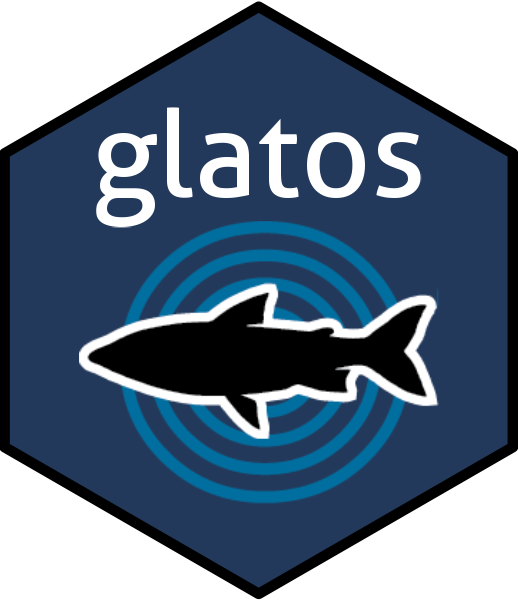
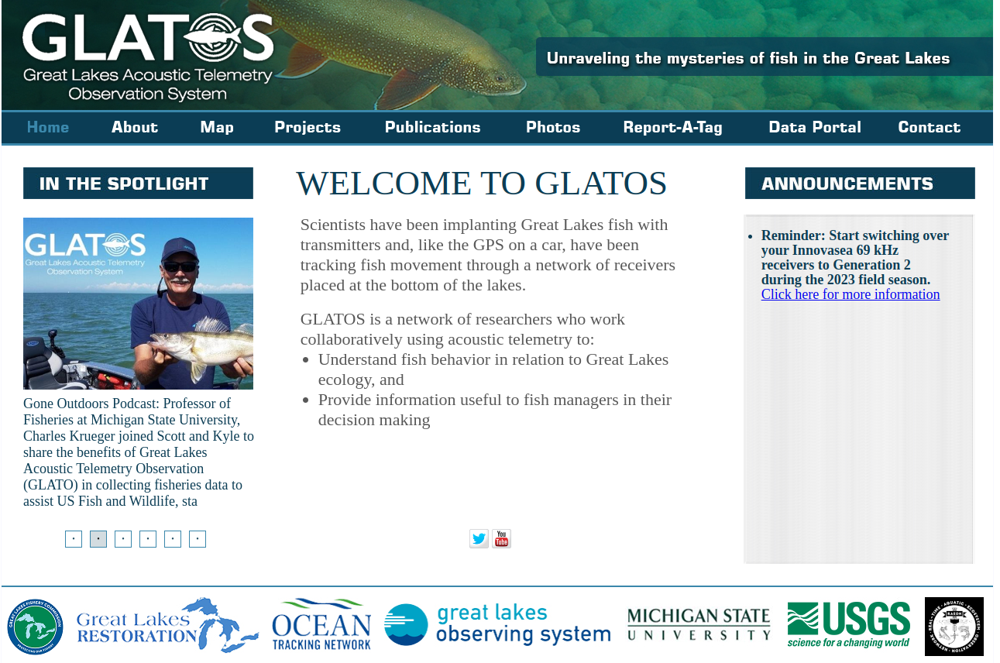
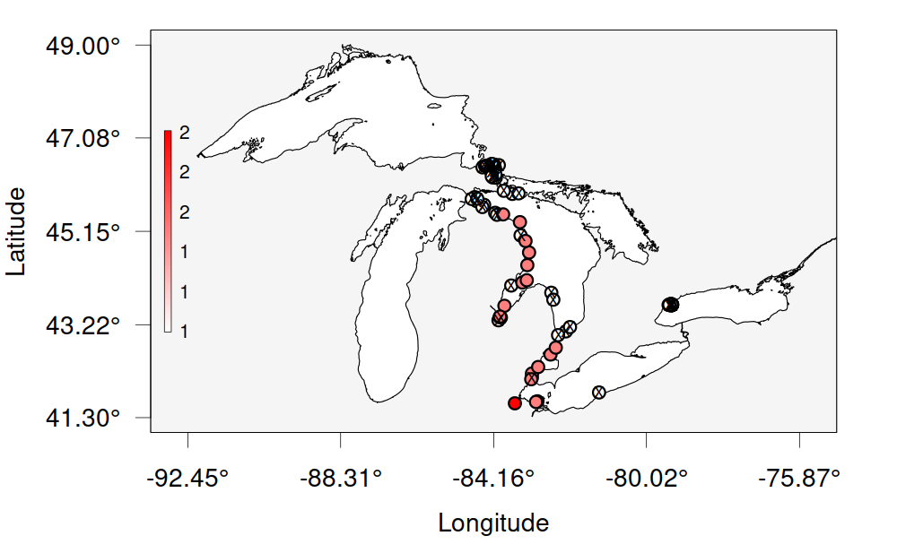
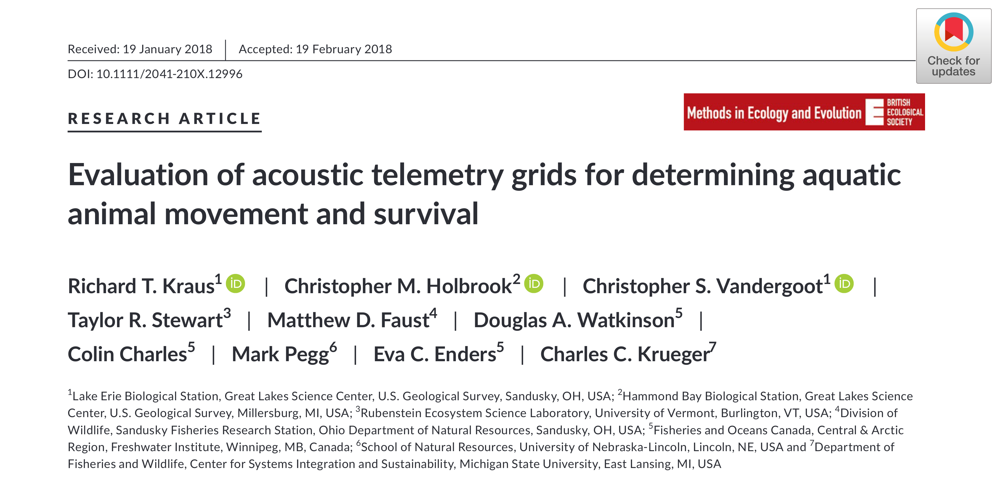
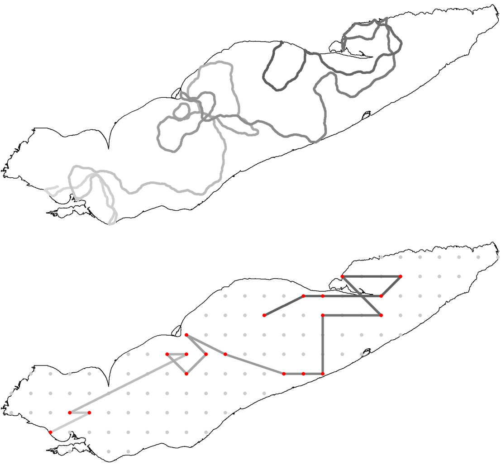
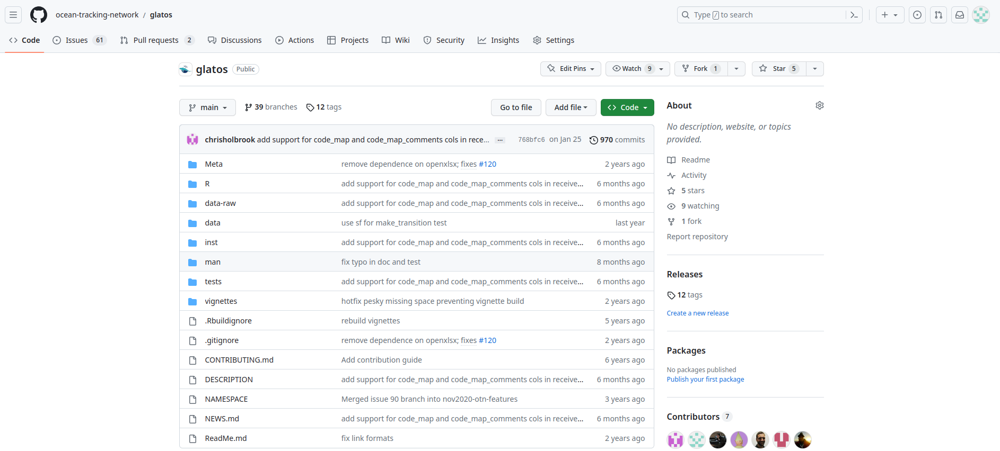
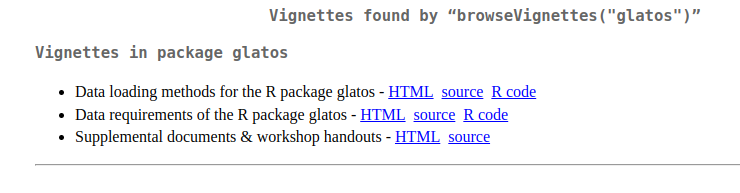
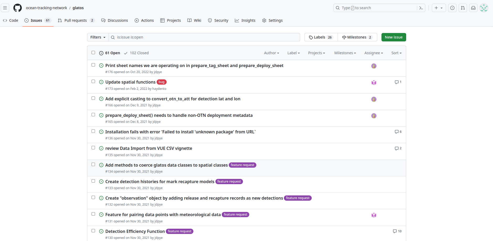

```{r setup, xaringan-themer, include=FALSE, warning=FALSE}
library(glatos)
library(kableExtra)
library(data.table)
library(xaringanthemer)
style_mono_light(
  base_color = "#23395b",
  header_font_google = google_font("Josefin Sans"),
  text_font_google   = google_font("Montserrat", "300", "300i"),
  code_font_google   = google_font("Fira Mono"),
  base_font_size = '20px',
  text_font_size = '1.2rem',
  code_font_size = '0.8rem'
)

```
```{r xaringan-panelset, echo=FALSE}
xaringanExtra::use_panelset()
```
```{r xaringan-fit-screen, echo=FALSE}
xaringanExtra::use_fit_screen()
```
class: center, middle

# <span style="color:grey">[R package]</span> `glatos`

  


Development team:  

**Christopher Holbrook**, U.S. Geological Survey  
**Todd Hayden, Tom Binder**, Michigan State University  
**Jon Pye and Ryan Grosse**, Ocean Tracking Network  

**Iowa Telemetry Workshop | 2023-07-18**

---

layout: true
background-image: url(images/GLATOS_logo.png)
background-position: 5% 95%
background-size: 10%
---


# Why <span style="color:grey">[R package]</span> `glatos`?

.pull-left[
## Raw Data

1. Access  
2. Wrangle  
3. Check, clean  
4. Summarize  
5. Explore  
6. Analyze  
]

.pull-right[
## Products

- Consistent (standardization)
- Reproducible
- Efficient
- Accessible
- Transparent  
]
<br />

.center[
## Community-driven best practices

]
---

# <span style="color:grey">[R package]</span> `glatos`: What does it do?

## Data loading and processing
- Read tag-release, detections, receiver data (from GLATOS)
- Read vender-supplied tag specifications and convert sensor values
- Convert proprietary detection files (*.vrl) to common text format (*.csv)

<br />


<div class="flex">
  
  
  
</div>

---
# <span style="color:grey">[R package]</span> `glatos`: What does it do?

### Load detection data from GLATOS

.panelset[
.panel[.panel-name[Code]

```{r workbook}
dtc_file <- system.file("extdata", "walleye_detections.csv", package = "glatos")
dtc <- read_glatos_detections(dtc_file)
```
]
.panel[.panel-name[Table]
```{r dtc_out, echo=FALSE}
kableExtra::kbl(dtc[1:5,], align="c") %>%
  kableExtra::kable_styling(bootstrap_options=c("striped", "hover", "condensed"), font_size = 12, position="center", full_width= TRUE) %>%
  scroll_box(width="1100px")

```
]
]
---

# <span style="color:grey">[R package]</span> `glatos`: What does it do?

## Filtering and summarizing
- Identify possible false positive detections (time isolation metric, Pincock 2012)
- Define detection events (simplification)
- Summary tables (by animals or location)
- Indicies of residence and occupancy at recevier locations

---
# <span style="color:grey">[R package]</span> `glatos`: What does it do?

### Filtering and summarizing- `detection events`

.panelset[
.panel[.panel-name[code]

```{r events, message=FALSE}
# load detection data
dtc_file <- system.file("extdata", "walleye_detections.csv", package = "glatos")
dtc <- read_glatos_detections(dtc_file)

# extract events, condensed format
events_condensed <- detection_events(dtc)

# extract events, long format
events <- detection_events(dtc, condense = FALSE)

```
]

.panel[.panel-name[Table, condensed=TRUE]
```{r events_out_con, echo=FALSE}
kableExtra::kbl(events_condensed[1:5,], align="c") %>%
  kableExtra::kable_styling(bootstrap_options=c("striped", "hover", "condensed"), font_size = 12, position="center", full_width= TRUE)
```
]

.panel[.panel-name[Table, condensed=FALSE]
```{r events_out, echo=FALSE}
kableExtra::kbl(events[1:5,], align="c") %>%
  kableExtra::kable_styling(bootstrap_options=c("striped", "hover", "condensed"), font_size = 12, position="center", full_width= TRUE) %>%
  scroll_box(width="1100px")
```
]
]
---
# <span style="color:grey">[R package]</span> `glatos`: What does it do?

### Filtering and summarizing- `summarize_detections`

.panelset[
.panel[.panel-name[code]

```{r dtc_summary, message=FALSE}

dtc_file <- system.file("extdata", "walleye_detections.csv", package = "glatos")
dtc <- read_glatos_detections(dtc_file)

# by animal or by location
ds_ani <- summarize_detections(dtc, summ_type="animal")
ds_loc <- summarize_detections(dtc, summ_type="location")

```
]

.panel[.panel-name[Animal]
```{r dtc_summary_ani, echo=FALSE}
kableExtra::kbl(ds_ani, align="c") %>%
  kableExtra::kable_styling(bootstrap_options=c("striped", "hover", "condensed"), font_size = 12, position="center", full_width= TRUE)

```
]

.panel[.panel-name[Location]
```{r dtc_summary_loc, echo=FALSE}
kableExtra::kbl(ds_loc[1:10,], align="c") %>%
  kableExtra::kable_styling(bootstrap_options=c("striped", "hover", "condensed"), font_size = 12, position="center", full_width= TRUE)

```
]
]

---
# <span style="color:grey">[R package]</span> `glatos`: What does it do?

## Visualization and data exploration
- Explore histories of individual animals (abacus plot)
- Explore distributions of animal groups (bubble maps)
- Interpolate movements of fish between receivers
- Make animated videos of fish movements

---

# <span style="color:grey">[R package]</span> `glatos`: What does it do?

### Visualization and data exploration- `abacus_plot`

.panelset[

```{r panelset=c("Code", output="Plot"), out.width='300px', out.height='300px', fig.align="center"}

# add locs where fish was not detected
locs <- c('DRL', 'FIC', 'DRF', 'GRW', 'GRE', 'BIN', 'DRU','LSC', 'THA', 'JHN','CHN', 'SCL', 'WLW',
          'FWW', 'FWE', 'BLE', 'SCM', 'MGW', 'MGE','STW', 'STE', 'BLK', 'SCU', "MAU", "RAR", "TSR")

# make abacus plot
abacus_plot(events[events$animal_id == "22", ],
            location_col='glatos_array',
            locations = locs,
            main="animal_id = 22",
            type = "o", col='darkred', cex = 2)


```
]

---

# <span style="color:grey">[R package]</span> `glatos`: What does it do?

### Visualization and data exploration- `detection_bubble_plot`

.panelset[

.panel[.panel-name[Code]
```{r bubble_code, message=FALSE, fig.show='hide', results='hide'}

# Add all receivers    
# get path to example receiver file- included in `glatos`
rec_file <- system.file("extdata", "sample_receivers.csv", package = "glatos")
rec <- read_glatos_receivers(rec_file)

# extract time of first and last detection
first <- min(dtc$detection_timestamp_utc) # time of first detection
last <- max(dtc$detection_timestamp_utc) # time of last detection     

# Subset receiver deployments oustide the detection period that have been deployed but not yet recovered.
plot_rec <- rec[rec$deploy_date_time < last & rec$recover_date_time > first & !is.na(rec$recover_date_time),]

# make plot
detection_bubble_plot(dtc, receiver_locs = plot_rec, out_file = "images/bubble.png")
     
```
]

.panel[.panel-name[Plot]
```{r echo=FALSE, out.width='500px', out.height='294px', fig.align="center"}


```
]
]

---

# <span style="color:grey">[R package]</span> `glatos`: What does it do?

### Simulations functions for system design and evaluation
- Estimate transmitter collision probabilities
- Simulate animal movement, signal transmissions, and detection among synthetic receiver arrays (lines, grids, etc)

- `crw_in_polygon` - simulate a random walk movement as equal-length steps with turning angles drwan from a normal distribution  

- `transmit_along_path` - simulate tag signal transmission along random walk path (constant velocity, transmitter delay, and duration of signal  

- `detect_transmissions` - simulate detection of transmitter signals based on detection range cureve, location of transmitter and location of receivers  

---

# <span style="color:grey">[R package]</span> `glatos`: What does it do?

### Simulations functions for system design and evaluation


<div class="flex">
	   
  </div>

---

# <span style="color:grey">[R package]</span> `glatos`: What does it do?

## Data export and crosswalks   
- Convert GLATOS formats to other telemetry system formats

- `convert_glatos_to_att` - GLATOS to Animal Tracking Toolbox or VTrack  

  - ATT/VTrack - github.com/rossdwyer/VTrack

- `convert_otn_erddap_to_att` - OTN to Animal Tracking Toolbox or VTrack

  - OTN - https://oceantrackingnetwork.org/


---
# <span style="color:grey">[R package]</span> `glatos`: What does it do?

## Animations  
- `interpolate_path` - Interpolate new positions within a spatiotemporal data set (i.e., detections of tagged fish) at regularly-spaced time intervals

- `make_frames` - Create a set of frames showing geographic locations or interpolated locations at discrete time intervals and stitch frames into an animated file

.center[

]

---
# <span style="color:grey">[R package]</span> `glatos`: What does it do?

## Glatos is NOT a sophisticated analysis software
- Provides tools for loading and exploring data, visualizations  

- No statistical models, only descriptive stats and visualizations  

- Use other packages for stats and in-depth analyses 

<br/>

.center[
## Analyses are project and objective specific
]

---

# Installing <span style="color:grey">[R package]</span> `glatos`

### https://github.com/ocean-tracking-network/glatos

.center[

]

### Installation (from R)

```{r echo=TRUE, eval = FALSE}
install.packages("remotes")
install.github("ocean-tracking-network/glatos", build_vignettes = TRUE)

``` 
---

# Getting help with <span style="color:grey">[R package]</span> `glatos`


### Vignettes

- Data loading methods for the R package `glatos`  
- Data requirements of the R package `glatos`  


```{r echo=TRUE, include = TRUE, eval=FALSE}
library(glatos)
browseVignettes("glatos")

``` 
.center[
 
]


---
# Getting help with <span style="color:grey">[R package]</span> `glatos`

### Supplemental Resources
- "Assessing acoustic tag and receiver performance: An approach for visualizing and analyzing passive detection range studies in R"  
- "Visualizing fish movements with animated videos in R: The ggplot2 and gganimate packages"  
- "Receiver efficiency index"  
- "Residence index"  
- "An introduction to R for analyzing acoustic telemetry data (v. 2.0)"

#### Download link for "An introduction to R....pdf")

https://glatos.glos.us/portal/downloadarchive?enc=7kUI8rtWVnajt36f1Ildc6yOSZgWRk9xUCSe6xoCQTr3JiFvzqpkWqU76AWD%2BU1gaX7L4uZALZ1h%2BxTCes%2Bhk6MrG%2FvtKi505AhzCvtFMDrCSrrB%2FXknscTRmxUUap%2FsgFnmQg5EPd3QJAe7gM3QbjJWNm19r%2F7maVHRFhRa4Rtnb0l63SLey%2FG7m7HiSMDkyyY%2BP4yxJ4Eh2%2B2FsM5c51eXdRuytXNjILZxxHT8AfQ%3D

---
# Help us to improve <span style="color:grey">[R package]</span> `glatos`

### File bug report at https://github.com/ocean-tracking-network/glatos/issues

.pull-left[

]

.pull-right[
### Email  

- Todd Hayden: thayden@usgs.gov  
- Chris Holbrook: cholbrook@usgs.gov  
- Tom Binder: trbinder@gmail.com  
]


